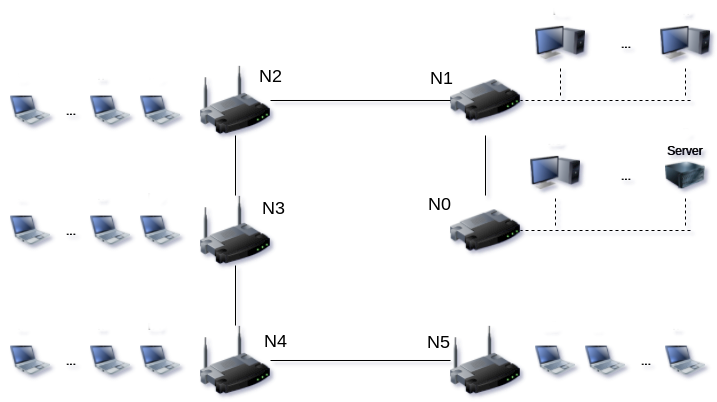

# [LocalNetworksNS3](https://github.com/LSantos06/IA-32)
### Trabalho 2 de Teleinformática e Redes 1 1/2017
O trabalho consiste na implementação no ambiente do _NS-3_ de uma topologia que possui 4 redes sem fio, e 2 redes _Ethernet_, cada uma 12 clientes, e apenas 1 servidor em uma das redes _Ethernet_. Os clientes mandam um pacote _UDP_ para o servidor, que mando o mesmo pacote de volta, como um eco.

  
   
  <t><b>Figura 1</b>: Topologia implementada.</t>
   

### Integrantes do grupo
* Eduardo Scartezini - 14/0130784
  - [X] _Versão do ns-3_: ns-allinone-3.25
  - [X] _Sistema Operacional_: Ubuntu 14.04.5 LTS
* Lucas Santos - 14/0151010
  - [X] _Versão do ns-3_: ns-allinone-3.25
  - [X] _Sistema Operacional_: elementary OS 0.4 Loki (64-bit) Built on "Ubuntu 16.04.2 LTS"
* Pedro Aurélio - 14/0158103
  - [X] _Versão do ns-3_: 
  - [X] _Sistema Operacional_: 
